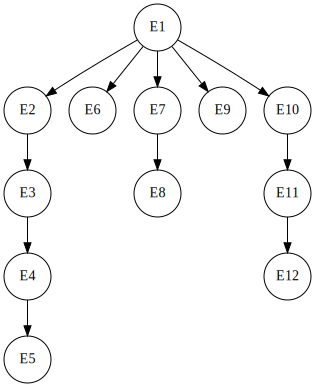

# Question 3 — Interprocess synchronization

This file transcribes the precedence graph and pseudocode presented in the submitted report.

## (a) Precedence graph



Equivalent edges:

```text
E1 → E2 → E3 → E4 → E5
E1 → E6
E1 → E7 → E8
E1 → E9
E1 → E10 → E11 → E12
```

## (b) Parallel pseudocode without semaphores

```text
E1;
cobegin
    begin
        E2;
        E3;
        E4;
        E5;
    end;

    E6;
    E9;

    begin
        E7;
        E8;
    end;

    begin
        E10;
        E11;
        E12;
    end;
coend;
```

## (c) Synchronization with one semaphore per precedence edge

```text
var s1, s2, s3, s4, s5, s6, s7, s8, s9, s10, s11 : semaphores;
s1 = s2 = s3 = s4 = s5 = s6 = s7 = s8 = s9 = s10 = s11 = 0;

cobegin
    begin E1; up(s1); up(s5); up(s6); up(s8); up(s9); end;
    begin down(s1);  E2;  up(s2);  end;
    begin down(s2);  E3;  up(s3);  end;
    begin down(s3);  E4;  up(s4);  end;
    begin down(s4);  E5;           end;
    begin down(s5);  E6;           end;
    begin down(s6);  E7;  up(s7);  end;
    begin down(s7);  E8;           end;
    begin down(s8);  E9;           end;
    begin down(s9);  E10; up(s10); end;
    begin down(s10); E11; up(s11); end;
    begin down(s11); E12;          end;
coend;
```

## (d) Submitted minimum-semaphore version

The five branches that follow `E1` share semaphore `s`. `E1` signals it five times, once for each dependent branch.

```text
var s, s13, s14, s15, s16, s17, s18 : semaphores;
s = s13 = s14 = s15 = s16 = s17 = s18 = 0;

cobegin
    begin E1; signal(s); signal(s); signal(s); signal(s); signal(s); end;
    begin wait(s);   E2;  signal(s13); end;
    begin wait(s13); E3;  signal(s14); end;
    begin wait(s14); E4;  signal(s15); end;
    begin wait(s15); E5;               end;
    begin wait(s);   E6;               end;
    begin wait(s);   E7;  signal(s16); end;
    begin wait(s16); E8;               end;
    begin wait(s);   E9;               end;
    begin wait(s);   E10; signal(s17); end;
    begin wait(s17); E11; signal(s18); end;
    begin wait(s18); E12;              end;
coend;
```
